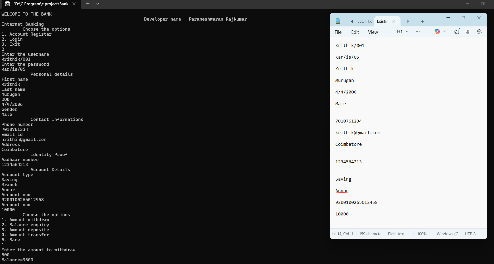

# Bank Server System using C

## Overview

This project is a console-based bank server system developed using the C programming language. It simulates basic banking operations such as account registration, login, and transaction management. The system uses file handling to store and manage customer data, making it a simple backend-like implementation of a banking system.

## System Description

The application provides an interface for both new and existing users. It allows users to register, securely log in, and perform various banking operations.

The system is menu-driven and operates through a command-line interface.

## Features

* New account registration
* Secure login for existing users
* Balance inquiry
* Amount deposit
* Amount withdrawal
* Amount transfer
* File-based data storage for each customer

## Working Principle

### Account Registration

* New users can create an account by providing details such as:

  * Username and password
  * Personal details (name, DOB, gender)
  * Contact details (phone number, email, address)
  * Identity proof (Aadhaar number)
  * Account details (type, branch, initial deposit)

* Once registered:

  * A unique account number is generated
  * Customer details are displayed
  * Data is stored in a file using file handling

### Login System

* Existing users can log in using username and password
* After successful login, users can access banking services

### Banking Operations

After login, the system provides options such as:

* Deposit amount
* Withdraw amount
* Check account balance
* Transfer amount

All operations are handled through structured functions and updated using file handling.

## File Handling Implementation

This project uses file handling as a backend storage mechanism:

* Each customer’s data is stored in a file
* New user registration creates a new file entry
* Existing user data is accessed and updated through file operations

This simulates how a basic server stores and retrieves user data.

## Technologies Used

* C Programming
* File Handling
* Structures
* Functions
* Preprocessor Directives

## Program Structure

* `main()` → Displays menu and controls flow
* `account_reg()` → Handles new user registration
* `login()` → Manages user authentication
* Transaction functions → Perform banking operations

## Applications

* Learning core C programming concepts
* Understanding file handling and data storage
* Simulation of basic banking system logic

## Conclusion

This project demonstrates how core C programming concepts can be used to build a simple bank server system. It highlights the use of file handling for data storage and provides a structured approach to implementing real-world applications using basic programming techniques.

## Sample Output

